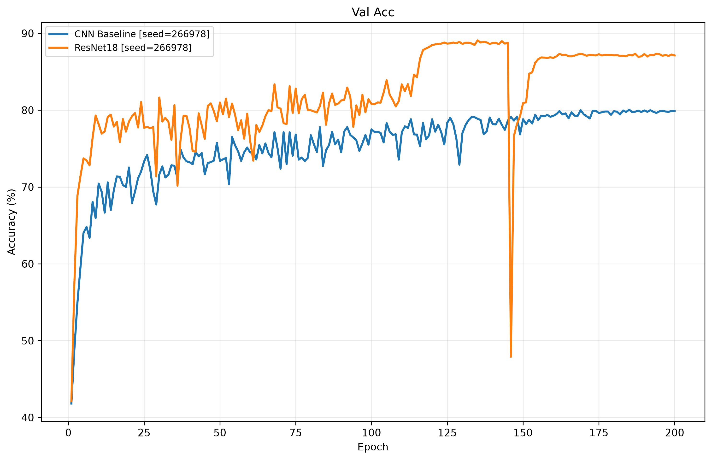
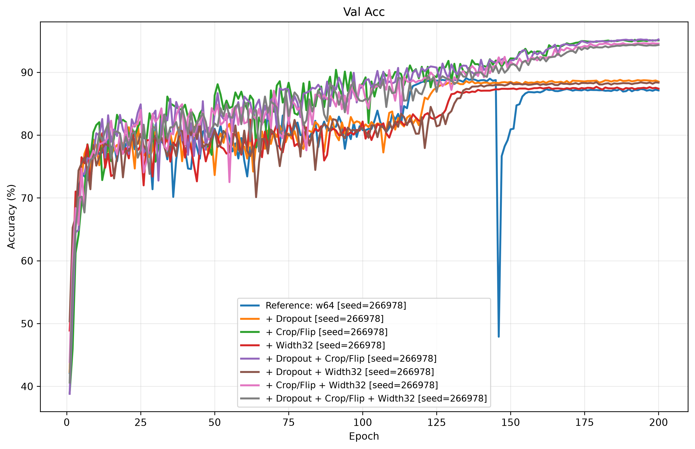
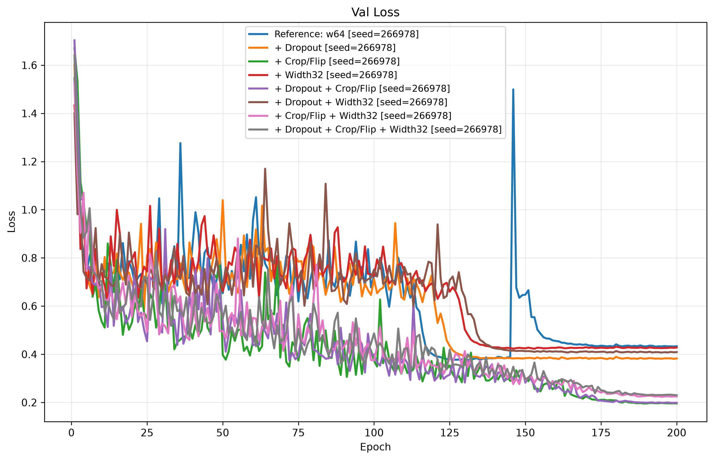
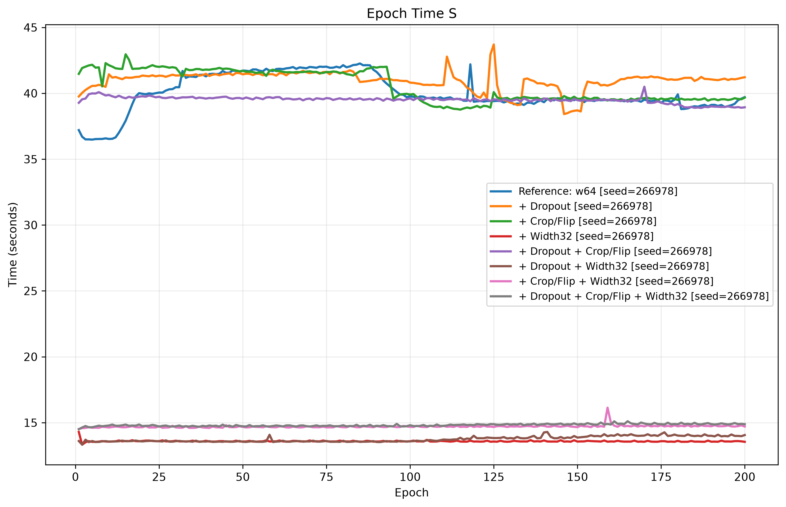
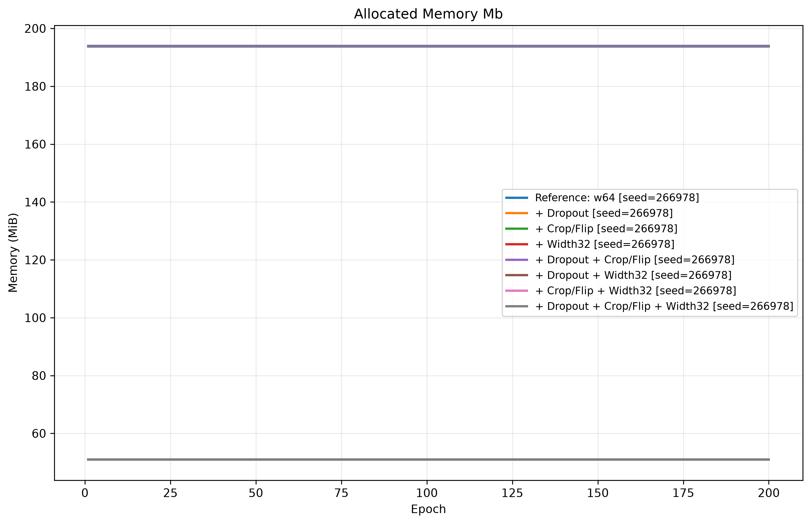

# CIFAR-10 图像分类实验报告

## 1. 实验目标

这个项目解决的不是单纯“把准确率跑高”，而是四个连续的问题：

1. 一个小型 CNN 能做到什么程度；
2. 换成 ResNet18 后，准确率为什么提高，代价又是什么；
3. Dropout、Crop/Flip 和网络宽度分别影响泛化还是效率；
4. 怎样用验证集、测试集和消融实验得到可信的结论。

数据集使用 CIFAR-10。官方 50,000 张训练图像被固定划分为 45,000 张训练集和 5,000 张验证集，官方 10,000 张测试图像只用于最终评估。所有正式实验固定随机种子为 `266978`，训练 200 个 epoch。

## 2. 我对训练问题的理解

### 2.1 Loss 和 accuracy 不是一回事

模型输出的是每一类的 logit，交叉熵再衡量正确类别的预测概率。Accuracy 只看最大 logit 对应的类别是否正确，因此它是离散指标；loss 还关心模型有多自信，因此更敏感。

这能解释一个常见现象：验证准确率可能基本不变，验证 loss 却继续上升。模型错的仍是那些样本，但它对错误答案越来越自信。UDL 第 5 章给出了交叉熵，第 8 章进一步说明：训练误差下降并不保证测试误差同步下降，测试 loss 也可能在后期反弹。所以“没有明显的先降后升”不能直接说明没有过拟合，也不能靠盲目增加 epoch 证明过拟合。

本实验中，CNN 的验证 loss 在 epoch 83 达到最低值 0.6546，epoch 200 为 0.6853；ResNet18 的最低值是 epoch 131 的 0.3760，epoch 200 上升到 0.4336。后者同时出现训练准确率 100%、最终验证准确率 87.12% 的差距，已经是明确的过拟合信号。

### 2.2 train、validation 和 test 各自回答不同问题

- 训练集用于计算梯度、更新参数；
- 验证集用于选超参数、选最佳 epoch；
- 测试集只回答最终模型对未见数据的泛化能力。

如果每个 epoch 都看 test loss，再据此决定训练多久或改什么结构，测试集实际上就参与了模型选择，最后的 test accuracy 会偏乐观。本项目每个 epoch 评估 validation，以最高 validation accuracy 保存 `best_weights.pt`，训练结束后加载它，只评估一次 test。这正是 UDL 第 8 章的模型选择流程，也符合第 9 章 early stopping 的思想。

### 2.3 优化器做的事

训练使用小批量 SGD。单个 batch 的梯度只是全数据梯度的带噪估计；Momentum 累积过去的更新方向，减少局部来回摆动；CosineAnnealingLR 将学习率从 0.1 平滑降到接近 0，使前期搜索较快、后期更新更细。`weight_decay=5e-4` 对权重施加 L2 约束，减少参数无限增大的倾向。

这里要区分“优化”和“泛化”：训练 loss 降得快，只说明优化器能拟合训练集；validation/test 表现才说明学到的函数能否推广到新样本。

## 3. 模型搭建

### 3.1 CNN baseline

Baseline 由三层 `3×3` 卷积组成，通道数依次为 32、64、128，中间使用 ReLU 和两次最大池化，最后用全局平均池化和线性分类器输出 10 类。它只有 94,538 个参数，作用是提供一个便宜、清楚的非残差参照。

### 3.2 CIFAR-10 ResNet18

本项目的模型是 ResNet18，但不是照搬 ImageNet 输入版本。CIFAR-10 图像只有 `32×32`，所以入口改成 `3×3, stride=1` 的卷积，没有使用 ImageNet 版本的 `7×7, stride=2` 和入口最大池化，避免过早丢失空间信息。

主体仍是标准的四个 stage，每个 stage 有两个 BasicBlock，即 `[2, 2, 2, 2]`。每个 BasicBlock 学习

\[
y = F(x) + x
\]

当分辨率或通道数变化时，shortcut 使用 `1×1` 卷积完成匹配。这就是它属于 ResNet 的根本原因：块不必从头学习完整映射，而是学习对当前表示的增量。恒等路径还给梯度提供了更直接的传播路线，使更深的网络更容易优化。BatchNorm 用于稳定各层激活的尺度，ReLU 提供非线性。这个理解对应 UDL 第 11 章对 residual connection 的解释：每个残差分支学习对已有表示的加性修改。

最后使用全局平均池化，再接可选的 Dropout 和线性分类器。它是针对 CIFAR-10 调整过入口的 ResNet18，不是一个任意堆叠卷积后借用名称的模型。

卷积层使用适合 ReLU 的 Kaiming 初始化，BatchNorm 的缩放和偏置分别初始化为 1 和 0，最终线性层偏置初始化为 0。初始化不会替代训练，但它决定了优化从什么尺度开始；不合理的随机偏置会让同一组消融实验失去公平的起点。

## 4. 实验设置与记录方式

| 项目 | 设置 |
| --- | --- |
| 数据 | CIFAR-10，45k train / 5k validation / 10k test |
| 输入归一化 | CIFAR-10 每通道 mean/std |
| epoch / batch size | 200 / 128 |
| 损失函数 | CrossEntropyLoss |
| 优化器 | SGD，lr=0.1，momentum=0.9，weight decay=5e-4 |
| 学习率 | CosineAnnealingLR |
| 随机种子 | 266978 |
| 设备 | Apple MPS |
| 模型选择 | validation accuracy 最高的 checkpoint |
| 测试 | 加载最佳 checkpoint 后测试一次 |

每次运行都有独立目录，保存冻结后的 `config.json`、逐 epoch 的 `metrics.csv`、最终 `summary.json`、最佳权重和可恢复训练的 checkpoint。图片只是从 CSV 重新生成的派生产物。这样实验参数、原始指标和展示结果不会混在一起，也能避免覆盖历史结果。

代码也按职责拆开：`dataset.py` 负责固定划分，并为 train 和 validation 建立不同的数据源，防止随机增强泄漏到验证集；`model.py` 只定义网络；`train.py` 完成训练、无梯度验证、checkpoint 和最终测试；`plot.py` 只读取已经保存的指标画图。训练逻辑和画图逻辑分开后，旧实验可以重新画图，但不会被重新训练或悄悄改写。

## 5. Baseline 与 ResNet18

两组模型比较使用相同的数据划分、训练参数和随机种子，不使用数据增强。

| 模型 | 最佳 val acc | Test acc | Test loss | 参数量 | 总训练时间 | 平均 epoch | MPS 已分配内存 |
| --- | ---: | ---: | ---: | ---: | ---: | ---: | ---: |
| CNN baseline | 80.06% | 80.10% | 0.6555 | 94,538 | 0.32 h | 5.74 s | 1.45 MiB |
| ResNet18 width64 | 89.08% | 88.99% | 0.3720 | 11,173,962 | 2.33 h | 41.75 s | 193.81 MiB |

ResNet18 的 test accuracy 提高了 8.89 个百分点，test loss 也明显降低，说明提升不只是分类边界碰巧多猜对了一些样本，预测概率整体也更合理。根本原因是 ResNet18 有更强的特征提取能力，残差连接又让这个更深的模型能够被有效优化。

代价同样明显：参数量约为 baseline 的 118 倍，训练时间约 7.3 倍，PyTorch 记录的 MPS 已分配内存约 134 倍。因此 ResNet18 的准确率优势不是免费的。baseline 更适合快速验证训练流程，ResNet18 才是后续结构和泛化实验的主体。

## 6. 三因素消融实验

我只改变三个因素，其他条件保持不变：

- Dropout：在全局平均池化后、最终分类器前使用 `p=0.3`；
- Crop/Flip：训练集使用 padding=4 的随机裁剪和随机水平翻转，验证与测试不增强；
- Width32：将 ResNet 的基础通道数从 64 减半为 32。

三个二值因素组成完整的 `2×2×2` 设计，共 8 组。完整组合比只做“reference 对比最终模型”更有价值，因为可以分开判断每个改动的主效应，以及它们组合后是否互相帮助。

| 组合 | 最佳 val acc | Test acc | Test loss | 参数量 | 总时间 | 平均 epoch | MPS 已分配内存 |
| --- | ---: | ---: | ---: | ---: | ---: | ---: | ---: |
| Reference：w64 | 89.08% | 88.99% | 0.3720 | 11.174 M | 2.23 h | 40.01 s | 193.81 MiB |
| + Dropout | 88.80% | 89.26% | 0.3571 | 11.174 M | 2.28 h | 40.97 s | 193.93 MiB |
| + Crop/Flip | **95.18%** | **95.12%** | **0.1834** | 11.174 M | 2.26 h | 40.56 s | 193.81 MiB |
| + Width32 | 87.70% | 88.15% | 0.4005 | 2.798 M | 0.76 h | 13.59 s | 50.92 MiB |
| + Dropout + Crop/Flip | **95.24%** | 94.96% | 0.1983 | 11.174 M | 2.20 h | 39.51 s | 193.93 MiB |
| + Dropout + Width32 | 88.44% | 87.98% | 0.4072 | 2.798 M | 0.77 h | 13.75 s | 50.92 MiB |
| + Crop/Flip + Width32 | 94.64% | 94.13% | 0.2253 | 2.798 M | 0.82 h | 14.70 s | 50.92 MiB |
| 三种全部加入 | 94.44% | 94.26% | 0.2343 | 2.798 M | 0.83 h | 14.81 s | 50.92 MiB |

八组实验总训练时间约 12.15 小时。

### 6.1 Crop/Flip 是准确率提升的主要来源

对完整八组结果取因素平均，加入 Crop/Flip 后 test accuracy 平均提高约 6.02 个百分点，而时间平均只增加约 1.18%，参数量和模型内存不变。这是三个改动中最明确的收益。

原因不是网络容量变大，而是训练分布变得更丰富。随机裁剪让模型不能依赖物体的固定位置，水平翻转让它学习对合理方向变化的不变性。UDL 第 9 章把数据增强解释为：用不改变语义的变换生成额外训练样本，迫使模型忽略无关变化。CIFAR-10 图像少且分辨率低，这种先验与任务匹配，所以泛化收益很大。

### 6.2 Width32 是最有效的效率改动

Width32 平均让 test accuracy 下降约 0.95 个百分点，但参数量减少 74.96%，训练时间减少约 64.67%，记录的 MPS 已分配内存减少约 73.73%。卷积参数量近似为

\[
k^2 C_{in} C_{out}
\]

当大部分层的输入、输出通道都减半，参数量和主要计算量接近原来的四分之一。这不是简单“少一半神经元”，而是同时缩小了卷积两端的通道维度。

在实际选择上，`Crop/Flip + Width32` 是更好的准确率—成本折中：test accuracy 为 94.13%，比 reference 高 5.14 个百分点，同时只保留 25.04% 的参数量、约 36.8% 的训练时间和约 26.3% 的已分配内存。

### 6.3 这次 Dropout 没有形成稳定收益

在完整因素平均下，Dropout 对 test accuracy 的影响只有约 +0.02 个百分点，可以视为没有稳定主效应。不能因为单独的 `+Dropout` 比 reference 高 0.27 个百分点，就断言它有效；这里只有一个种子，这种量级很可能是训练波动。

根本原因在于 Dropout 的位置：它位于全局平均池化之后，只作用于最后的特征向量和很小的线性分类头，没有直接约束占绝大多数参数的卷积主体。网络同时已有 BatchNorm、weight decay；加入 Crop/Flip 后，主要的泛化问题又已经被更匹配任务的数据增强缓解。UDL 对 Dropout 的解释是随机屏蔽隐藏单元，降低网络对特定单元的依赖，但一种正则化方法是否有效，仍取决于施加位置和当前过拟合来源。

因此本实验支持的结论是“当前放置方式下不值得加入”，而不是“Dropout 对所有卷积网络都无效”。

## 7. 收敛、异常下降和最佳 checkpoint

使用 Crop/Flip 的模型最终最好，但最佳 epoch 普遍较晚。这不代表它优化更差，而是每个 epoch 看到的图像变换都不同，训练任务更难，模型在学习更稳定的不变特征。例如 w64 Crop/Flip 在 epoch 91 首次达到 90% val accuracy；Width32 + Crop/Flip 在 epoch 109 达到 90%，按平均 epoch 时间估算分别约 61.5 分钟和 26.7 分钟。后者 epoch 数更多，但实际墙钟时间更短，所以判断“收敛快慢”不能只看 epoch。

Reference ResNet18 在 epoch 145 的 validation accuracy 为 88.76%，epoch 146 突然降到 47.90%；训练准确率也从 100% 降到 91.10%，下一轮继续降到 74.90%。当时学习率只是由约 0.0181 平滑变化到 0.0175，不存在调度器跳变，因此根本原因不是“学习率在 146 突然改变”。

更合理的判断是：某个 batch 产生了破坏性较强的参数更新，Momentum 延续了这个方向，深层网络中的 BatchNorm 统计量也随之偏移，导致训练和验证同时崩落。现有日志只记录 epoch 级指标，没有 batch 梯度范数和 BN 统计量，所以不能进一步断言是哪一个 batch。相同配置的重复运行出现了相同轨迹，说明它与固定的数据顺序和优化轨迹有关，不是画图错误。

这也说明保存最佳 checkpoint 的必要性。Reference 的最佳模型在 epoch 135，test accuracy 为 88.99%；如果直接拿 epoch 200 的最后状态测试，就会把训练后期的退化误认为模型真实能力。

## 8. 性能指标应该怎样一起看

- `train loss/acc`：判断模型有没有能力拟合、优化是否正常；
- `validation loss/acc`：判断泛化趋势并选择模型；
- `test loss/acc`：在模型选择结束后给出一次最终结论；
- `time`：要同时看总时间和单 epoch 时间，epoch 数不等于实际成本；
- `parameters`：决定权重存储量，但不能完全代表运行内存；
- `memory`：还包含激活、梯度和优化器状态，通常受 batch size、特征图尺寸和通道数影响。

本报告中的 MPS 内存是 PyTorch 的 `current_allocated_memory`，不是整机内存，也不是严格的训练峰值。MPS 没有暴露与 CUDA 相同的 peak-memory 计数器，因此这里只能在同一设备、同一实现下做相对比较，不能把 193.81 MiB 当成模型运行所需的全部系统内存。

## 9. 最终结论

1. CIFAR 版 ResNet18 的核心仍是残差块和恒等捷径；调整输入 stem 不改变它作为 ResNet18 的本质。
2. ResNet18 相比小型 CNN 把 test accuracy 从 80.10% 提高到 88.99%，但参数、时间和内存成本大幅增加。
3. Crop/Flip 是本次实验最有效的泛化改动，平均带来约 6.02 个百分点的 test accuracy 提升。
4. Width32 用约 0.95 个百分点的平均准确率代价，换来约 75% 的参数和内存下降，以及约 65% 的训练时间下降。
5. Dropout 在当前分类头位置没有稳定收益，不应因为单种子下的微小差别把它写成有效改进。
6. 只追求本次最高 test accuracy，应选择 `w64 + Crop/Flip`（95.12%）；综合 accuracy、time、memory 和参数量，应选择 `w32 + Crop/Flip`（94.13%）。三种改动全部加入没有得到足以证明 Dropout 必要性的收益。

## 10. 实验局限

本次为了控制时间只使用一个随机种子，因此能可靠判断 5～6 个百分点的大差异，但不能把 0.1～0.3 个百分点解释为稳定提升。`runtime.deterministic=false` 也意味着固定种子不等于所有设备上逐位复现。后续如果要发表更强结论，应对少量候选方案补 3～5 个种子并报告均值和标准差。

此外，本实验记录的是训练时间和训练时的 PyTorch 内存，没有测 FLOPs、模型文件大小、推理延迟和吞吐量。所以目前可以判断 Width32 的训练效率明显更好，但不能直接声称它在所有部署环境中快同样的比例。

## 参考

- Simon J. D. Prince, *Understanding Deep Learning*：第 5 章损失函数，第 6 章随机梯度下降，第 8 章性能度量与验证集，第 9 章正则化和数据增强，第 11 章残差网络。
- 本项目 `runs/` 中各实验的 `config.json`、`metrics.csv` 和 `summary.json`；汇总表见 `reports/model_comparison/` 与 `reports/resnet18_ablation/`。
